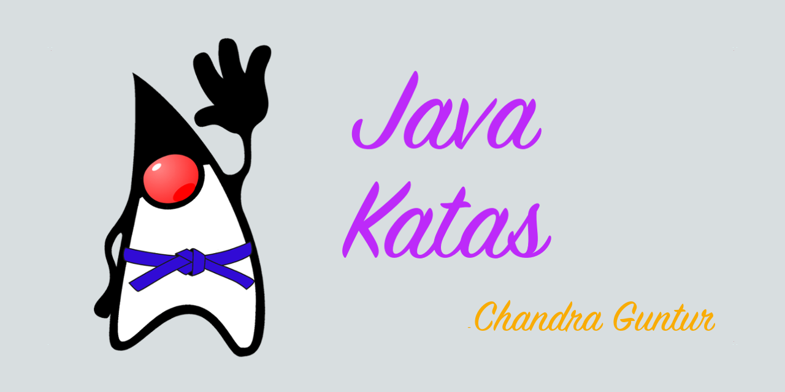

= java-katas

image::https://travis-ci.org/c-guntur/java-katas.svg?branch=master[link="https://travis-ci.org/github/c-guntur/java-katas"]
image:https://img.shields.io/badge/License-MIT-lightsalmon.svg[link="LICENSE"]
image:https://img.shields.io/badge/CodeKata-Java-blue.svg[link="https://github.com/topics/codekata"]

One repo to rule them all. Java code katas - using JUnit5

The java-katas is a code repository for learning various Java features.

== What is a kata (a code kata) ?

From http://wikipedia: Kata originally were teaching and training methods by which successful combat techniques were preserved and passed on. Practicing kata allowed a company of persons to engage in a struggle, using a systematic approaches, rather by practicing in a repetitive manner the learner develops the ability to execute those techniques and movements in a natural, reflex-like manner. Systematic practice does not mean permanently rigid. The goal is to internalize the movements and techniques of a kata; so they can be executed and adapted under different circumstances, without thought or hesitation. A novice’s actions will look uneven and difficult, while a master’s appear simple and smooth.

=== What is a code kata?

From http://codekata.com: Code Kata is an attempt to bring the element of practice to software development. A kata is an exercise in karate where you repeat a form many, many times, making little improvements in each. The intent behind code kata is similar. Each is a short exercise (perhaps 30 minutes to an hour long). Some involve programming, and can be coded in many ways. Some are open-ended, and involve thinking about the issues behind programming. These are unlikely to have a single correct answer.

Code katas were first introduced by Dave Thomas and are a great tool to practice programming something new.

== So, what is in this repo?

This Git repo is a collection of several code katas about features, utilities and APIs in Java language. 

The general structure of each project is a maven quickstart project with a pom.xml, a src directory that contains at least two directories. Code Katas are available under the src/test/java while solutions are under src/solutions/java under each module. The code katas typically contain failing tests with TODO markers that need to be fixed in order to fix the test, 

**Remember, the src/solutions may not be the perfect way to solve the kata, maybe a solution you come up with is better**. Feel free to submit a pull request if you think you have a better solution than the one you find.

=== Current katas

`java-handles`:: Understand Java Reflection and `sun.misc.Unsafe`, then, learn the alternates for those in Method Handles API and VarHandles API in more recent version of Java.

`java-datetime`:: Learn the Java Time API (introduced in Java 8), that replaces the java.util.Date and java.util.Calendar with a more humane and extensible API.

`java-optional`:: Learn the Java Optional API, as a replacement for null-checks and unexpected ``NullPointerException``s that crop up causing developer unhappiness and/or application instability issues.

`java-lambdas`:: Learn Java Lambdas, a feature that allows for closure-like syntax, and the ability to replace anonymous classes with functional blocks.

`java-futures`:: Learn Java CompletableFuture API, an API that allows for synchronous as well as asynchronous tasks with pipelines and task chaining/combinations with many ways to handle exceptions, with and without recovery paths.

More katas will be added, feel free to contribute if you have ideas.