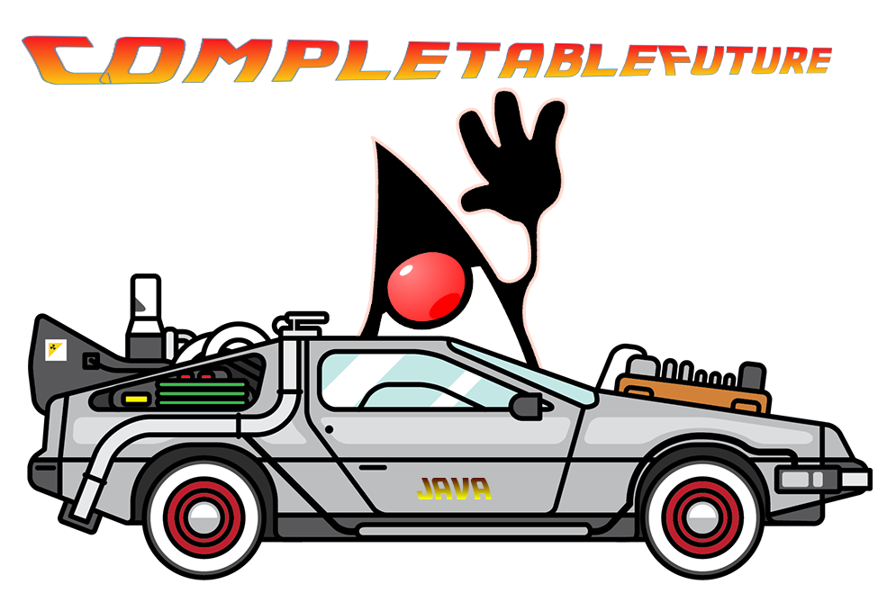

= java-futures
:toc:
:toclevels: 4
== Java CompletableFuture API - A Code kata

`java.util.concurrent.CompletableFuture` is a versatile utility in Java (since Java 8).It provides a means of task execution, both synchronous and asynchronous.

A CompletableFuture implements `java.util.concurrent.Future` (available since Java 5) and `java.util.concurrent.CompletionStage` (available since Java 8) and adds additional methods for operating on tasks.

Some additional documentation about the three in this kata:

* link:assets/docs/Future.adoc[Future]
* link:assets/docs/CompletionStage.adoc[CompletionStage]
* link:assets/docs/CompletableFuture.adoc[CompletableFuture]

A special lookup for exception handling:

* link:assets/docs/Exceptions.adoc[Exception Handling in CompletableFuture]

include::../CodeKataMission.adoc[]

== Requirements
How to prepare for coding along

This kata is developed as a Java maven project. Ensure that you have:

. Apache Maven 3.6.x or above. _Tested with Apache Maven 3.6.3_.
    Link: https://maven.apache.org/download.cgi

. JDK 11 or above. _Tested with OpenJDK 16_
    Link: http://jdk.java.net/11/

. Your favorite Java IDE. _IntelliJ IDEA Ultimate was used to develop this kata_.

== Project Structure

The structure of the project:

[source]
----
|____pom.xml
|____README.adoc               <------------------- This file
|____assets
| |____docs                    <------------------- Documentation
| |____images
|____src
| |____test                    <------------------- Kata Tests
| | |____java
| |   |____none
| |     |____cvg
| |       |____futures
| |____solutions               <------------------- Solutions
| | |____java
| |   |____none
| |     |____cvg
| |       |____futures
----

== Tests Included

==== Java CompletableFuture

The JUnit tests listed below are set up to utilize the Java CompletableFuture API features.

link:src/test/java/none/cvg/futures/TestKata1SimpleCompletableFutureOperations.java[TestKata1SimpleCompletableFutureOperations.java]:: covers the basic features of creating CompletableFuture instances and fetching results.

link:src/test/java/none/cvg/futures/TestKata2HandleExceptionsInCompletableFuture.java[TestKata2HandleExceptionsInCompletableFuture.java]:: covers how CompletableFuture exceptions are handled. +
Also check: link:assets/docs/Exceptions.adoc[Tabulated Exception Handling in CompletableFuture]

include::assets/docs/Exceptions.adoc[]

link:src/test/java/none/cvg/futures/TestKata3CompletableFutureExecutions.java[TestKata3CompletableFutureExecutions.java]:: covers some common executions in CompletableFuture.

link:src/test/java/none/cvg/futures/TestKata4CompletableFutureChaining.java[TestKata4CompletableFutureChaining.java]:: covers CompletableFuture chaining.

link:src/test/java/none/cvg/futures/TestKata5CompletableFutureCombinations.java[TestKata5CompletableFutureCombinations.java]:: Tcovers a few common combinations in CompletableFuture.

== Solutions

.Solutions for each test
|===
| Kata Test | Solution

|link:src/test/java/none/cvg/futures/TestKata1SimpleCompletableFutureOperations.java[TestKata1SimpleCompletableFutureOperations.java]
|link:src/solutions/java/none/cvg/futures/TestSolution1SimpleCompletableFutureOperations.java[TestSolution1SimpleCompletableFutureOperations.java]

|link:src/test/java/none/cvg/futures/TestKata2HandleExceptionsInCompletableFuture.java[TestKata2HandleExceptionsInCompletableFuture.java]
|link:src/solutions/java/none/cvg/futures/TestSolution2HandleExceptionsInCompletableFuture.java[TestSolution2HandleExceptionsInCompletableFuture.java].

|link:src/test/java/none/cvg/futures/TestKata3CompletableFutureExecutions.java[TestKata3CompletableFutureExecutions.java]
|link:src/solutions/java/none/cvg/futures/TestSolution3CompletableFutureExecutions.java[TestSolution3CompletableFutureExecutions.java]

|link:src/test/java/none/cvg/futures/TestKata4CompletableFutureChaining.java[TestKata4CompletableFutureChaining.java]
|link:src/solutions/java/none/cvg/futures/TestSolution4CompletableFutureChaining.java[TestSolution4CompletableFutureChaining.java]

|link:src/test/java/none/cvg/futures/TestKata5CompletableFutureCombinations.java[TestKata5CompletableFutureCombinations.java]
|link:src/solutions/java/none/cvg/futures/TestSolution5CompletableFutureCombinations.java[TestSolution5CompletableFutureCombinations.java]

|===

== Take Away

The key take-away from this kata is a solid understanding of the Java CompletableFuture API.
