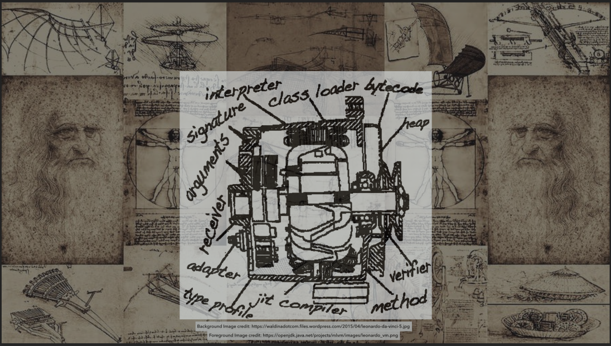

= Method Reflection and Unsafe alternates Kata
:toc:
:toclevels: 4

Many Java libraries and frameworks currently use Reflection and Unsafe APIs.
With the newer modular Java some of these important tools of our trade may become incompatible and/or may not work as desired.In addition, several enterprise applications also rely on Core Reflection, (if not the use of Unsafe APIs).

== What is a Code-Kata

A code-kata is a coding exercise that builds muscle memory by a practice of programming to arrive
at a known solution.

=== How does one go about with this code kata?

The essence of the exercise (presentation material and code kata) is to demonstrate the
usage patterns for the java API or functionality.

This set of code katas rely on fixing broken tests. The tests may have multiple solutions, the
intent is to learn and experiment.

The project contains several JUnit tests that fail.

==== Simple steps to use this kata

. Run the test class(es).
. One or more tests will fail with the test failure message.
. Fix the failing tests by using `HINT` and `TODO` comments.
. Repeat above steps until all tests pass.
. Check the solutions to see if there are other ways to solve.
(Remember, the solution may be less performant/optimal than yours)
. Rinse and repeat (delete and checkout again, then back to Step 1) to build muscle memory.

=== Mission
> Your mission, should you choose to accept it, will be to fix the JUnit tests. This
message will self-destruct in `**NaN**` minutes.

== Requirements

How to prepare for coding along

This kata is developed as a Java maven project.Ensure that you have:

. Apache Maven 3.6.x or above. _Tested with Apache Maven 3.6.3_.
Link: https://maven.apache.org/download.cgi

. JDK 11 or above. _Tested with OpenJDK 11_
Link: http://jdk.java.net/11/

. Your favorite Java IDE. _IntelliJ IDEA Ultimate was used to develop this kata_.

== Project Structure

The structure of the project:

[source]
----
|____pom.xml
|____README.md
|
|____src
| |
| |____test                    <------------------- Kata Tests
| | |____java
| |   |____none
| |     |____cvg
| |       |____constructors
| |       |____methods
| |       |____variables
| |
| |____main                    <------------------- Shared ErrorMessages & DemoClass
| | |____java
| |   |____none
| |     |____cvg
| |
| |____solutions               <------------------- Solutions 
| | |____java
| |   |____none
| |     |____cvg
| |       |____constructors
| |       |____methods
| |       |____variables
----

== Tests Included

=== Java Reflection and recent alternates

There are a few JUnit tests with an aim to practice method access alternates to Reflection.

Each test class may have two types of test methods:

* **Solved** test methods show how an invocation/access can be achieved with the traditional calls.

* **Unsolved/failing** test methods provide TODO hints that will allow the kata-taker to manually solve the exercise to
achieve the same with MethodHandles/VarHandles.

==== Constructor invocation

link:src/test/java/none/cvg/constructors/TestKataDefaultConstructorInvocation.java[TestKataDefaultConstructorInvocation.java]:: using MethodHandles to invoke a **default constructor** on a class in order to create a new instance. 

link:src/test/java/none/cvg/constructors/TestKataParameteredConstructorInvocation.java[TestKataParameteredConstructorInvocation.java]:: using MethodHandles to invoke a **constructor with a parameter** on a class in order to create a new instance. 

==== Method invocation

link:src/test/java/none/cvg/methods/TestKataPublicMethodInvocation.java[TestKataPublicMethodInvocation.java]:: using MethodHandles to invoke a **public method** on a class. 

link:src/test/java/none/cvg/methods/TestKataPackageProtectedMethodInvocation.java[TestKataPackageProtectedMethodInvocation.java]:: using MethodHandles to invoke a **package-protected (default-access) method** on a class.

link:src/test/java/none/cvg/methods/TestKataProtectedMethodInvocation.java[TestKataProtectedMethodInvocation.java]:: using MethodHandles to invoke a **protected method** on a class. 

link:src/test/java/none/cvg/methods/TestKataPrivateMethodInvocation.java[TestKataPrivateMethodInvocation.java]:: using MethodHandles to invoke a **private method** on a class. 

link:src/test/java/none/cvg/methods/TestKataPublicStaticMethodInvocation.java[TestKataPublicStaticMethodInvocation.java]:: using MethodHandles to invoke a **public static method** on a class. 

=== sun.misc.Unsafe and recent alternates

There are a few JUnit tests with an aim to practice variable access alternates to Unsafe.

link:src/test/java/none/cvg/variables/TestKataGetter.java[TestKataGetter.java]::
*Get variable values*: show the differences between traditional reflection/Unsafe usage and the Handles API. In each of the below: **The traditional access test passes**, solve the alternate.

  * `public` variables.
  * `private` variables.
  * `one-dimensional array` variables.
  * `two-dimensional array` variables.

link:src/test/java/none/cvg/variables/TestKataCompareAndSet.java[TestKataCompareAndSet.java]::
*Compare and Set variable value*: show the differences between traditional reflection/Unsafe usage and the Handles API. In each of the below: **The traditional access test passes**, solve the alternate.

  * Using `AtomicReference` - **Solved**.
  * Using `AtomicReferenceFieldUpdater` - **Solved**.
  * Using `Unsafe` - **Solved**.
  * Using `VarHandle` - ***Unsolved***, use the `TODO`s to fix.

link:src/test/java/none/cvg/variables/TestKataVarHandlesForbiddenUnsafeFeatures.java[TestKataVarHandlesForbiddenUnsafeFeatures.java]::
*Var Handles restrictions that were possible with Unsafe*: highlight functionality available with Reflection/Unsafe that no longer are available using VarHandles.

  * Modify a `private final` variable using traditional calls - **Solved**.
  * Cannot modify a `private final` variable using VarHandles - ***Unsolved***, use the ``TODO``s to fix.
  * Modify a `public static final` constant using traditional calls - **Solved**.
  * Cannot modify a `public static final` constant using VarHandles - ***Unsolved***, use the ``TODO``s to fix.

== Solutions

.Solutions for each test:
|===
|Kata Test | Solution
| ------------ | -------------

| link:src/test/java/none/cvg/constructors/TestKataDefaultConstructorInvocation.java[TestKataDefaultConstructorInvocation.java] 
| link:src/solutions/java/none/cvg/constructors/TestSolutionDefaultConstructorInvocation.java[TestSolutionDefaultConstructorInvocation.java]

| link:src/test/java/none/cvg/constructors/TestKataParameteredConstructorInvocation.java[TestKataParameteredConstructorInvocation.java] 
| link:src/solutions/java/none/cvg/constructors/TestSolutionParameteredConstructorInvocation.java[TestSolutionParameteredConstructorInvocation.java]

| ---- | ----

| link:src/test/java/none/cvg/methods/TestKataPublicMethodInvocation.java[TestKataPublicMethodInvocation.java] 
| link:src/solutions/java/none/cvg/methods/TestSolutionPublicMethodInvocation.java[TestSolutionPublicMethodInvocation.java]

| link:src/test/java/none/cvg/methods/TestKataPackageProtectedMethodInvocation.java[TestKataPackageProtectedMethodInvocation.java] 
| link:src/solutions/java/none/cvg/methods/TestSolutionPackageProtectedMethodInvocation.java[TestSolutionPackageProtectedMethodInvocation.java]

| link:src/test/java/none/cvg/methods/TestKataProtectedMethodInvocation.java[TestKataProtectedMethodInvocation.java] 
| link:src/solutions/java/none/cvg/methods/TestSolutionProtectedMethodInvocation.java[TestSolutionProtectedMethodInvocation.java]

| link:src/test/java/none/cvg/methods/TestKataPrivateMethodInvocation.java[TestKataPrivateMethodInvocation.java] 
| link:src/solutions/java/none/cvg/methods/TestSolutionPrivateMethodInvocation.java[TestSolutionPrivateMethodInvocation.java]

| link:src/test/java/none/cvg/methods/TestKataPublicStaticMethodInvocation.java[TestKataPublicStaticMethodInvocation.java] 
| link:src/solutions/java/none/cvg/methods/TestSolutionPublicStaticMethodInvocation.java[TestSolutionPublicStaticMethodInvocation.java]

| ---- | ----

| link:src/test/java/none/cvg/variables/TestKataGetter.java[TestKataGetter.java] 
| link:src/solutions/java/none/cvg/variables/TestSolutionGetter.java[TestSolutionGetter.java]

| link:src/test/java/none/cvg/variables/TestKataCompareAndSet.java[TestKataCompareAndSet.java] 
| link:src/solutions/java/none/cvg/variables/TestSolutionCompareAndSet.java[TestSolutionCompareAndSet.java]

| link:src/test/java/none/cvg/variables/TestKataVarHandlesForbiddenUnsafeFeatures.java[TestKataVarHandlesForbiddenUnsafeFeatures.java] 
| link:src/solutions/java/none/cvg/variables/TestSolutionVarHandlesForbiddenUnsafeFeatures.java[TestSolutionVarHandlesForbiddenUnsafeFeatures.java]

|===

== Take Away

The key take-away from this kata is a solid understanding of the
simpler and more common usages of Core Reflection API and Unsafe API alongside the newer Handles
API both in similarity and in certain cases, how they differ.

Who knows if your next open source/enterprise contribution is with helping out a library, framework
or an enterprise application in converting to the newer APIs ?