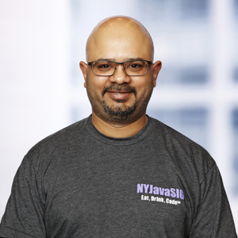

# CHANDRA GUNTUR - #Saganist

## Active in Java Community
* **JUG Leader**: Organizer, Presenter at NYJavaSIG and NYJavaSIG Hands-On Workshops

* **Speaker**: Oracle Code One, Devnexus, QCon New York, Oracle Code New York and at several Java User Groups

* **Advocacy**: Active on *blogging* and *tweeting* on all things Java

## Work Portfolio

* Director, Resilient Systems Engineering
* Java, Eclipse Collections, Spring Boot/Cloud & Microprofile Advocate & Evangelist
* Typical-day tools: Java, Groovy, Spring Boot, Vert.x, Drools, Spock

#### Twitter: @CGuntur

[<< Prev](page00.md) 
&#160;&#160;&#160;&#160;&#160;&#160;&#160;&#160;&#160;&#160;&#160;
&#160;&#160;&#160;&#160;&#160;&#160;&#160;&#160;&#160;&#160;&#160;
&#160;&#160;&#160;&#160;&#160;&#160;&#160;&#160;&#160;&#160;&#160;
&#160;&#160;&#160;&#160;&#160;&#160;&#160;&#160;&#160;&#160;&#160;
&#160;&#160;&#160;&#160;&#160;&#160;&#160;&#160;&#160;&#160;&#160; 
[Next >>](page02.md) 

