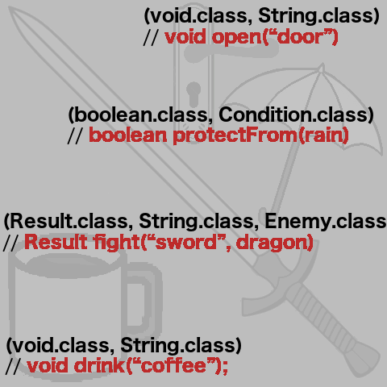

# MethodType - "The Discriminator"

* Represents return type and input parameters of a method :
  * First parameter of a method type is return type
  * Other parameters are input parameter types
* Immutable
* Primitives, arrays and void (return) values are types :
  * **`int.class`**
  * **`double.class`**
  * **`void.class`**
  * **`int[].class`**
  * **`...`**

https://docs.oracle.com/en/java/javase/11/docs/api/java.base/java/lang/invoke/MethodType.html

[<< Prev](page10.md) 
&#160;&#160;&#160;&#160;&#160;&#160;&#160;&#160;&#160;&#160;&#160;
&#160;&#160;&#160;&#160;&#160;&#160;&#160;&#160;&#160;&#160;&#160;
&#160;&#160;&#160;&#160;&#160;&#160;&#160;&#160;&#160;&#160;&#160;
&#160;&#160;&#160;&#160;&#160;&#160;&#160;&#160;&#160;&#160;&#160;
&#160;&#160;&#160;&#160;&#160;&#160;&#160;&#160;&#160;&#160;&#160; 
[Next >>](page12.md) 
